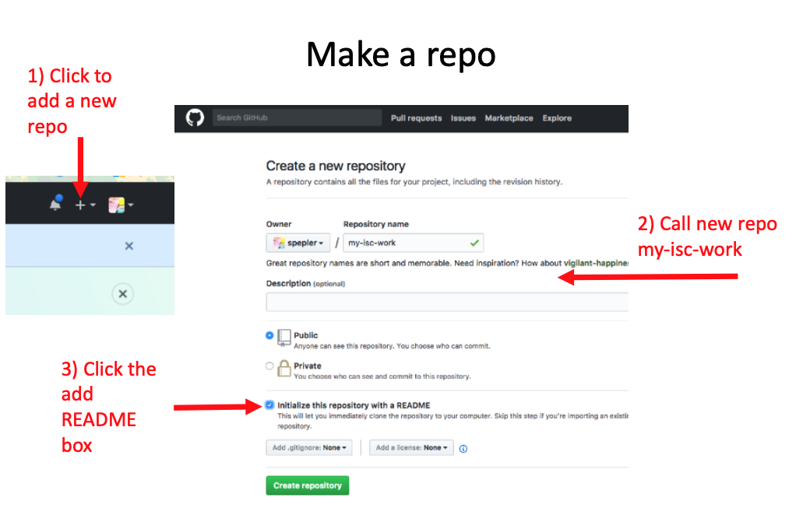
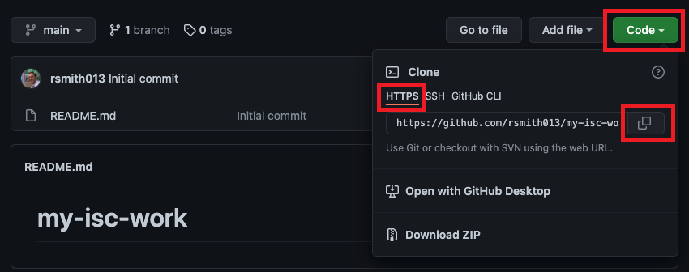

# Exercise 1: Getting Started with GitHub

## Aim

To get you set up with a GitHub account and **personal access token**.
Then to create an empty repository to put your work from the week and get used to using
the basic workflow of Git.

### Issues Covered

- Access tokens
- Github
- Git Repos
- Clone/Commit/Push 

## 1. Sign up for GitHub

If you don't already have an account go to https://github.com and sign up (top right)
    


## 2. Generate an access token to use as your password and setup the Git client

GitHub has moved away from username and password as a way of authenticating repo access.
Username/Password combos are known to be insecure 
(how many do you really have, you should probably have 100s) and we will likely see the way
we authenticate change across the internet over the next few years.
    
To generate a token:
    
1. Login to **GitHub**
2. Click on your name/avatar in the top right corner and select **Settings**
3. On the left, click **Developer Settings**
4. Select **Personal access tokens**, then **Tokens (classic)** and click **Generate new token (classic)**
5. Give the token a description/name (such as `repo-access`) in the box labelled **Note** and tick the box for **repo** scope (you can read more about scopes using the **Read more about OAuth scopes** link)
6. Click **Generate Token**
7. Copy the token - this can be used like a password when authenticating via `Git` (you might want to put this in a password manager)
    

    
**Configure your git client (in the terminal)**
    
This tells the Git client running in the terminal who you are.
    
On linux, the commands look like: 

```
git config --global user.name "<your-username>"
git config --global user.email "<your-email>"
git config -l
```

The `git config -l` will show you all the values stored in the config 
(this may show an error if viewed in the Notebook Service terminal - you can ignore that).
    
When you clone a repo, it will ask for your username/password.
Enter your **username**, and **access token** as the password.
    
**Credential Caching**

It is annoying to have to enter your credentials every time you connect to the
remote GitHub service (i.e. pushing or pulling content). 

Thankfully, you can _cache_ your credentials.
    
```
git config --global credential.helper cache
```
    
This saves your username/access token in memory (for up to 15 minutes) so you don't need it everytime.
    
If you need to clear it:
    
```
git config --global --unset credential.helper
```
    
There are other stores (you can [look these up](https://git-scm.com/docs/gitcredentials) another time):
- `credential.helper store` - stores credentials on disk
- `credential.helper osxkeychain` - can be used with MacOS to store credentials in MacOSs keychain
- `credential.helper "cache --timeout 3600"` - memory cache for up to an hour

## 3. Make a repo for your Introduction to Scientific Computing work

Go to GitHub in your browser, make sure you are logged in, and create
a new repository.

**NOTE: Remember to tick: Initialize this repository with a README**



## 4. Copy the clone link

Copy the link to the repository so that you can clone it in your terminal:



## 5. Clone the repo

In your terminal window, clone the repository you have just created:

1. Open the terminal
2. Make sure you are in your home directory (you can get there with the command: `cd`)
3. Clone the repository with: `git clone <your-github-repo-url>`
    
It will then prompt for username and password (it won't ask again if you have your credentials cached).
**REMEMBER: In this case, you should give it your Access token (generated above)**
    
You have now cloned the repo. Now we are going to make a change and push it.

## 6. Make a change

```bash
cd my-isc-work/
# The `touch` command will create a new file
touch mydata.txt
```
    
If you now run `ls` you will see two files. `README.md` and `mydata.txt`.
    
See what has changed.
    
```
git status
```
    

    
Add the changed file to git
    
```
git add mydata.txt
``` 
(can use `git add .` to add all files)

Write a message to say what you have done and make a **commit**.

```
git commit -m "Adding an empty file as part of tutorial"
```

Push the change to GitHub

```
git push 
# or you can do: git push origin main # where origin==GitHub and main==remote branch name
```

## 7. Refresh the GitHub page in your browser

You will now see empty file `mydata.txt` exists on the GitHub version of 
the repository.

## 8. Copy the python notebooks directory into your new repository (for ISC)

If working on ISC exercises...

```
# Go to the local copy of your repository
cd ~/my-isc-work

# Make a local "python" directory
mkdir python

# Copy the entire "notebooks" directory from the "ncas-isc" repo to your local repo
cp -r ~/ncas-isc/python/notebooks python/
```

## 9. Add the new files to git and push to github

If working on ISC exercises...

```
git add python
git commit -m "Added notebooks"
git push
```
